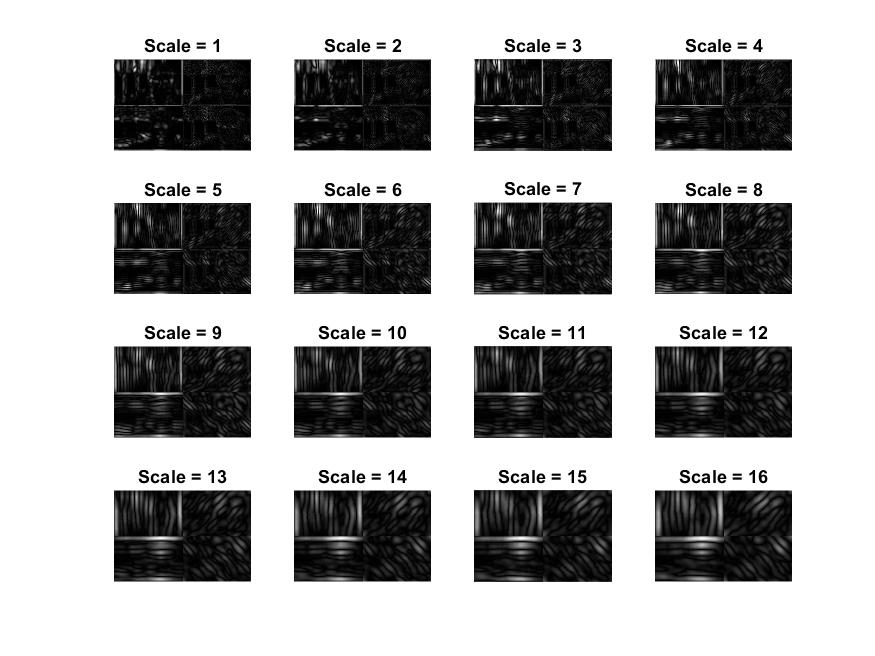
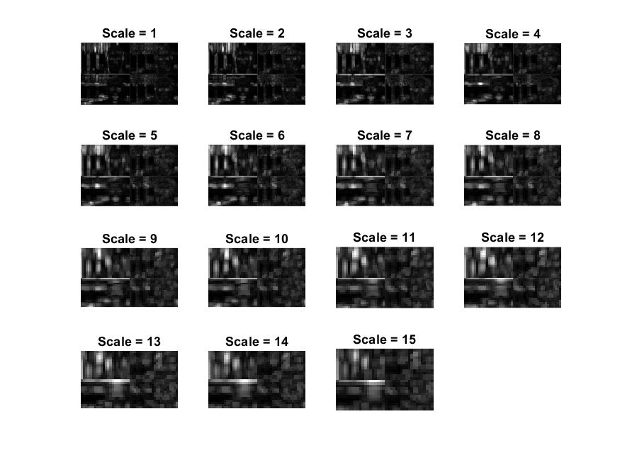

# Visualization

To visualize the different activations maps, use functions available in the `helpers.display` package.

## Display S1 and C1

In order to visualize S1 ans C1, you can use the `display.P1` function. (P1 stand for Phase 1).
```matlab
fig = helpers.display.P1(S1);
```

This result in this type of figure:


*Here, we have our image filtered by a gabor filter in 4 orientations and in 16 scale.*

The same thing after the max pooling:


